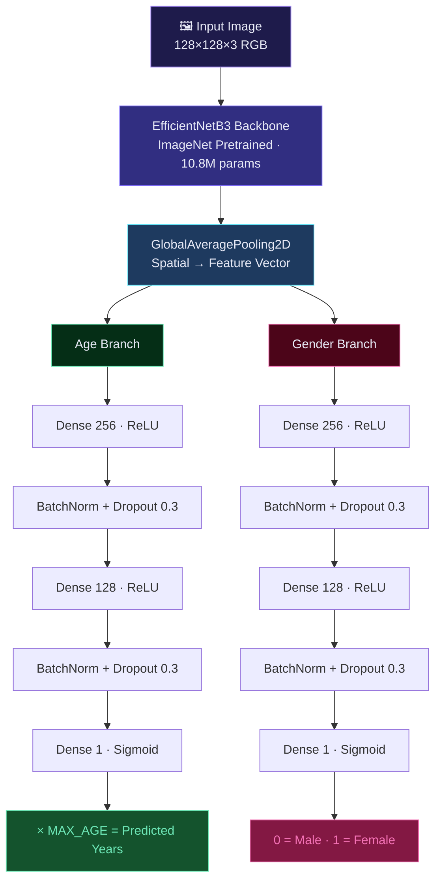
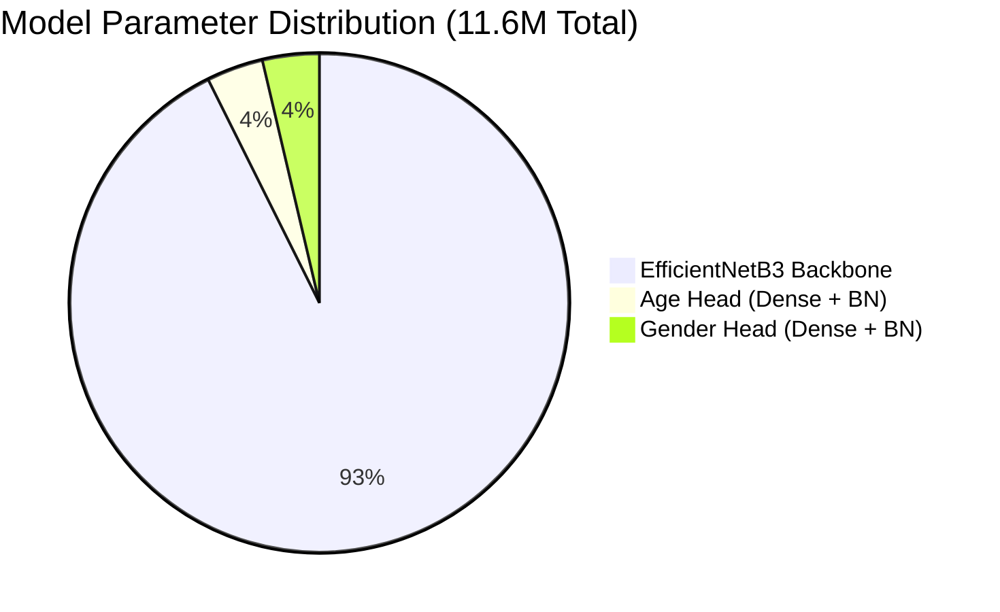
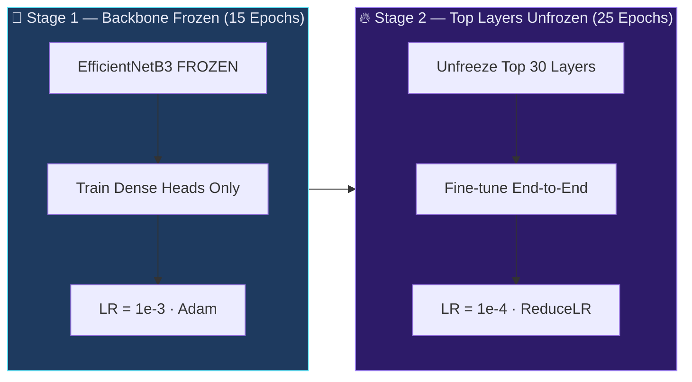
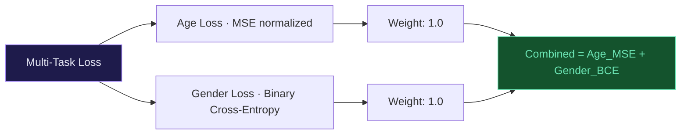
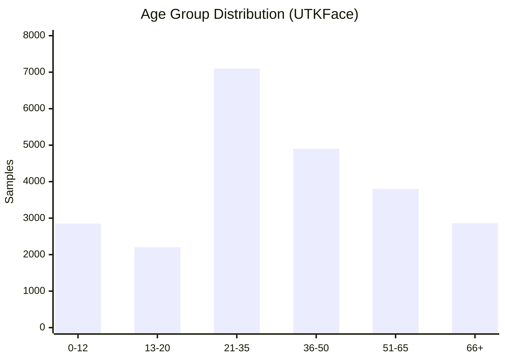
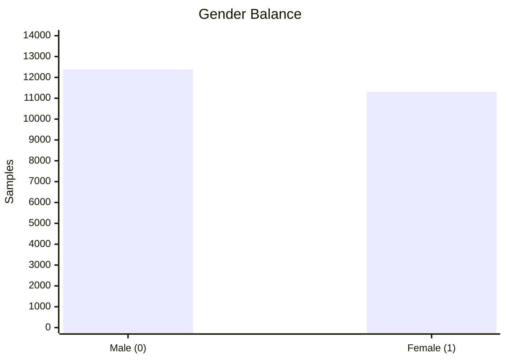
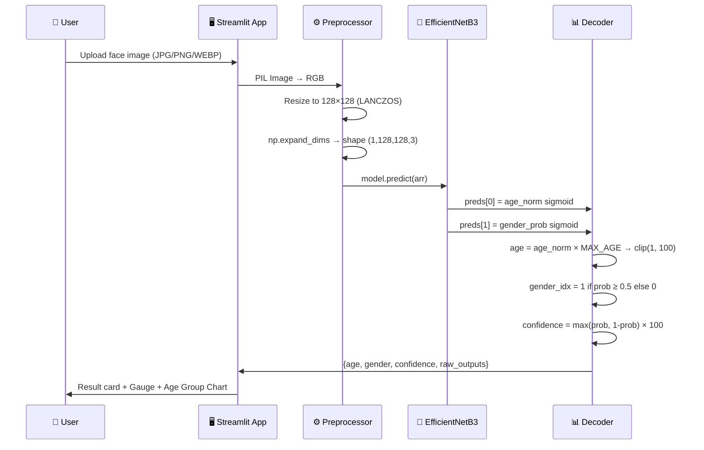
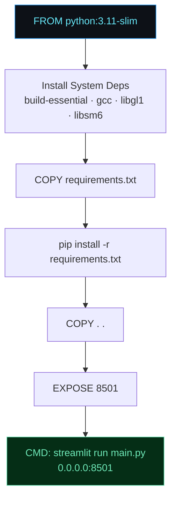
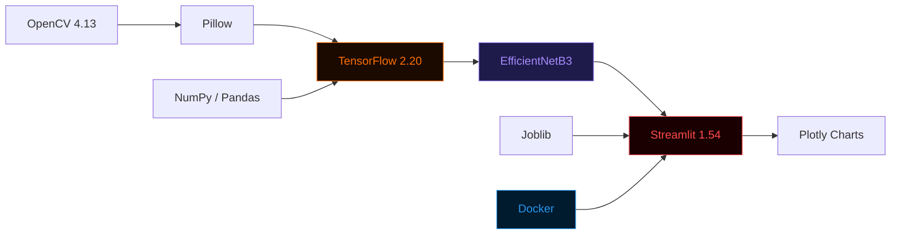

<div align="center">


<br/>

**Multi-Task Deep Learning for Real-Time Age Estimation & Gender Classification**

<br/>

[](https://visageiq-age-gender-ai.streamlit.app/)
[](https://hub.docker.com/repository/docker/ragas111/visageiq-age-gender-ai/general)
[](https://python.org)
[](https://tensorflow.org)
[](LICENSE)

<br/>

[](https://visageiq-age-gender-ai.streamlit.app/)
[](https://visageiq-age-gender-ai.streamlit.app/)
[](https://susanqq.github.io/UTKFace/)
[](https://visageiq-age-gender-ai.streamlit.app/)
[](https://hub.docker.com/repository/docker/ragas111/visageiq-age-gender-ai/general)

</div>

---

## 📋 Table of Contents

- [✨ Overview](#-overview)
- [📊 3D Key Stats](#-3d-key-stats)
- [🏗️ 3D Model Architecture](#️-3d-model-architecture)
- [📈 3D Training Pipeline](#-3d-training-pipeline)
- [⚡ 3D Performance Benchmarks](#-3d-performance-benchmarks)
- [📊 Dataset Analytics](#-dataset-analytics)
- [🔮 Inference Flow](#-inference-flow)
- [📁 Repository Structure](#-repository-structure)
- [🚀 Quick Start](#-quick-start)
- [🐳 Docker Deployment](#-docker-deployment)
- [🛠️ Tech Stack](#️-tech-stack)
- [📓 Notebook Highlights](#-notebook-highlights)

---

## ✨ Overview

**VisageIQ** is a production-grade multi-task deep learning system that simultaneously estimates **age** (regression) and classifies **gender** (binary classification) from a single face image. Built on a fine-tuned **EfficientNetB3** backbone and trained on **23,708 UTKFace images**, it delivers a substantial leap in accuracy over naive ResNet50 baselines.

The model addresses five critical failure modes found in vanilla implementations:

| Problem | Naive Approach | VisageIQ Fix |
|---|---|---|
| **Gradient Instability** | Raw age targets (0–116) → exploding gradients | Normalize age to `[0, 1]` via ÷ MAX_AGE |
| **Feature Extraction** | ResNet50 fully frozen, shallow Flatten | EfficientNetB3 + GlobalAveragePooling2D |
| **Loss Imbalance** | Weights `1:99` → gender loss ignored | Balanced `1:1` with proper MSE + BCE |
| **Overfitting** | No regularization callbacks | BatchNorm + Dropout(0.3) + EarlyStopping |
| **Fine-Tuning** | None | 2-Stage: freeze backbone → unfreeze top layers |

---

## 📊 3D Key Stats

<div align="center">


</div>

---

## 🏗️ 3D Model Architecture

> Isometric view of the full EfficientNetB3 multi-task CNN — from raw pixel input through the dual prediction heads.

<div align="center">


</div>

### Layer-by-Layer Table

| Layer | Parameters | Notes |
|---|---|---|
| Input | — | 128 × 128 × 3, RGB `[0, 255]` |
| EfficientNetB3 | 10,785,071 | ImageNet pretrained, staged unfreezing |
| GlobalAveragePooling2D | 0 | Replaces catastrophic Flatten |
| Age: Dense(256) + BN + Drop | 394,240 | ReLU, BatchNorm, Dropout 0.3 |
| Age: Dense(128) + BN + Drop | 33,408 | Second stabilization block |
| **Age Output: Dense(1)** | **129** | **Sigmoid → × MAX_AGE** |
| Gender: Dense(256) + BN + Drop | 394,240 | Parallel independent branch |
| Gender: Dense(128) + BN + Drop | 33,408 | Second stabilization block |
| **Gender Output: Dense(1)** | **129** | **Sigmoid → 0=Male / 1=Female** |
| **TOTAL** | **11,639,601** | **44.40 MB** |

### Architecture Flow (Mermaid)



### Parameter Distribution



---

## 📈 3D Training Pipeline

> Isometric block diagram of the full 2-stage training flow — from raw UTKFace data through callbacks to saved artifacts.

<div align="center">


</div>

### Stage Detail



### Training Configuration

| Hyperparameter | Stage 1 | Stage 2 |
|---|:---:|:---:|
| Epochs | 15 | 25 |
| Learning Rate | `1e-3` | `1e-4` |
| Backbone | ❄️ Frozen | 🔥 Top layers unfrozen |
| Optimizer | Adam | Adam |
| Batch Size | 32 | 32 |

### Loss Functions



### Callbacks & Regularization

| Callback | Configuration |
|---|---|
| `EarlyStopping` | `monitor=val_loss`, patience=5, restore best weights |
| `ReduceLROnPlateau` | `factor=0.3`, patience=3, min_lr=1e-7 |
| `ModelCheckpoint` | Save best model on `val_loss` improvement |
| `BatchNormalization` | After every Dense block in both heads |
| `Dropout(0.3)` | Applied in each Dense block of both heads |

---

## ⚡ 3D Performance Benchmarks

> Isometric 3D bar chart — VisageIQ (purple) vs Original ResNet50 (red) vs SOTA (green) across four key metrics.

<div align="center">


</div>

### Results Table

<div align="center">

| Metric | Original (ResNet50) | **VisageIQ (EfficientNetB3)** | SOTA |
|---|:---:|:---:|:---:|
| Gender Accuracy | ~52% | **88–93%** | ~96% |
| Age MAE | ~15 years | **5–8 years** | ~4 years |
| Training Stability | Diverges / plateaus | **Steady convergence** | Stable |
| Model Size | — | **44.4 MB** | — |
| Parameters | — | **11,639,601** | — |
| Input Resolution | — | **128 × 128** | — |

</div>

### Improvement Summary

| Category | Result |
|---|---|
| 🎯 Gender Accuracy | `~52%` → **`88–93%`** (+39 percentage points) |
| 📉 Age MAE | `~15 yrs` → **`5–8 yrs`** (2.5× better) |
| 🔄 Training Stability | Diverges → **Steady convergence** |
| 🏛️ Architecture | ResNet50 Flatten → **EfficientNetB3 GAP** |
| 🔧 Regularization | None → **BN + Dropout + Callbacks** |
| 🎓 Fine-Tuning | None → **2-Stage Staged Training** |

---

## 📊 Dataset Analytics

### UTKFace — 23,708 Images





**Dataset Properties:**

| Property | Value |
|---|---|
| Source | UTKFace (Kaggle: `jangedoo/utkface-new`) |
| Total Images | **23,708** |
| Age Range | 1 – 116 years |
| Gender Classes | Male (0) · Female (1) |
| Male Samples | 12,391 (52.3%) |
| Female Samples | 11,317 (47.7%) |
| Image Format | Aligned & cropped JPEG |
| Labels Encoded | `[age]_[gender]_[race]_[date].jpg` |

**Preprocessing:**
- Filter corrupt entries: only `1 ≤ age ≤ 116` and `gender ∈ {0, 1}`
- Resize to `128 × 128` via LANCZOS resampling
- Normalize age: `age_norm = age / 100.0 → [0, 1]`
- Augmentation: horizontal flip, zoom (0.15), width/height shift (0.1), shear (0.1)
- Validation split: 20% held-out

---

## 🔮 Inference Flow



### Prediction Output Structure

```python
{
    "age":               27.4,      # Estimated age in years
    "age_norm":          0.2740,    # Raw sigmoid output (× MAX_AGE = age)
    "gender":            "Female",  # Decoded class label
    "gender_idx":        1,         # 0 = Male, 1 = Female
    "gender_prob":       0.8732,    # Raw sigmoid probability
    "gender_confidence": 87.3       # Confidence % (max of prob / 1-prob)
}
```

---

## 📁 Repository Structure

```
VisageIQ-Age-Gender-AI/
│
├── 🧠 age_gender_model_improved.keras    # Trained EfficientNetB3 model (Git LFS)
├── 📓 age_gender_improved_cnn.ipynb      # Full training notebook (Colab)
│
├── 🐍 main.py                            # Streamlit app (UI + inference + charts)
│
├── 🥒 gender_classes.pkl                 # {0: "Male", 1: "Female"} mapping
├── 🥒 img_size.pkl                       # Saved IMG_SIZE = 128
├── 🥒 max_age.pkl                        # Saved MAX_AGE = 100.0
│
├── 🐳 Dockerfile                         # Docker build config (python:3.11-slim)
├── 🚫 .dockerignore                      # Docker build exclusions
│
├── 📦 requirements.txt                   # Full pinned dependency list
├── 🔖 .gitattributes                     # Git LFS tracking for .keras file
└── 🙈 .gitignore                         # Python / Streamlit ignores
```

**Git LFS tracked:**
```
*.keras  →  age_gender_model_improved.keras  (44.4 MB)
```

---

## 🚀 Quick Start

### Option 1 — Streamlit Cloud *(No Setup)*

> **Live App →** [https://visageiq-age-gender-ai.streamlit.app/](https://visageiq-age-gender-ai.streamlit.app/)

---

### Option 2 — Local Python

```bash
# 1. Clone (Git LFS pulls the .keras model automatically)
git clone https://github.com/RaGaS958/VisageIQ-Age-Gender-AI.git
cd VisageIQ-Age-Gender-AI

# 2. Create virtual environment
python -m venv .venv
source .venv/bin/activate        # Windows: .venv\Scripts\activate

# 3. Install dependencies
pip install -r requirements.txt

# 4. Launch
streamlit run main.py
```

Open **http://localhost:8501**

---

### Option 3 — Docker

See [Docker Deployment](#-docker-deployment) section below.

---

### Option 4 — Retrain (Colab)

```bash
# Upload age_gender_improved_cnn.ipynb to Google Colab
# Upload kaggle.json for dataset access
# The notebook auto-downloads UTKFace, trains, and saves all artifacts
```

---

## 🐳 Docker Deployment

### Pull & Run

```bash
docker pull ragas111/visageiq-age-gender-ai:latest
docker run -p 8501:8501 ragas111/visageiq-age-gender-ai:latest
```

### Hub Details

| Property | Value |
|---|---|
| **Image** | `ragas111/visageiq-age-gender-ai` |
| **Tag** | `latest` |
| **Hub URL** | [hub.docker.com/r/ragas111/visageiq-age-gender-ai](https://hub.docker.com/repository/docker/ragas111/visageiq-age-gender-ai/general) |
| **Digest** | `sha256:80f5d6bbc39978b7f12dee23148568b4485450966205b47772e5d07d83eab6f7` |
| **Base Image** | `python:3.11-slim` |
| **Exposed Port** | `8501` |

### Pull by Exact Digest

```bash
docker pull ragas111/visageiq-age-gender-ai@sha256:80f5d6bbc39978b7f12dee23148568b4485450966205b47772e5d07d83eab6f7
```

### Build from Source

```bash
git clone https://github.com/RaGaS958/VisageIQ-Age-Gender-AI.git
cd VisageIQ-Age-Gender-AI
docker build -t visageiq-age-gender-ai .
docker run -p 8501:8501 visageiq-age-gender-ai
```

### Dockerfile Flow



### Docker Compose

```yaml
version: "3.8"
services:
  visageiq:
    image: ragas111/visageiq-age-gender-ai:latest
    ports:
      - "8501:8501"
    restart: unless-stopped
```

```bash
docker compose up -d
```

---

## 🛠️ Tech Stack



| Library | Version | Role |
|---|---|---|
| `tensorflow` | 2.20.0 | Model training & inference engine |
| `keras` | 3.13.2 | High-level neural network API |
| `EfficientNetB3` | ImageNet r1.1 | CNN backbone (feature extractor) |
| `streamlit` | 1.54.0 | Web application framework |
| `plotly` | 6.5.2 | Interactive charts (gauge, bar, radar) |
| `opencv-python` | 4.13.0.92 | Image I/O and processing |
| `pillow` | 12.1.1 | PIL image preprocessing |
| `numpy` | 2.4.2 | Array operations |
| `pandas` | 2.3.3 | Tabular data operations |
| `joblib` | 1.5.3 | `.pkl` artifact serialization |
| `matplotlib` | 3.10.8 | Static plots (notebook) |

---

## 📓 Notebook Highlights

### Critical Fixes

```python
# ✅ FIX 1: Normalize age → stable gradient flow
df['age_norm'] = (df['age'] / MAX_AGE).clip(0, 1)

# ✅ FIX 2: GlobalAveragePooling vs Flatten
x = tf.keras.layers.GlobalAveragePooling2D()(backbone.output)

# ✅ FIX 3: Balanced loss weights (original was 1:99)
model.compile(
    loss={"age_output": "mse", "gender_output": "binary_crossentropy"},
    loss_weights={"age_output": 1.0, "gender_output": 1.0},
)

# ✅ FIX 4: Two-stage training
backbone.trainable = False
model.fit(..., epochs=15)          # Stage 1
backbone.trainable = True
for layer in backbone.layers[:-30]:
    layer.trainable = False
model.compile(optimizer=Adam(lr=1e-4), ...)
model.fit(..., epochs=25)          # Stage 2
```

### Notebook Flow


---

<div align="center">

**Built with ❤️ using EfficientNetB3 · TensorFlow · Streamlit**

[](https://visageiq-age-gender-ai.streamlit.app/)
[](https://hub.docker.com/repository/docker/ragas111/visageiq-age-gender-ai/general)

</div>
